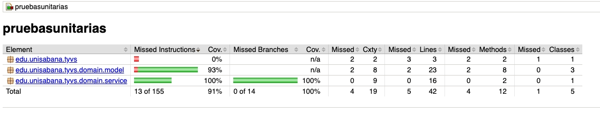

# 📊 Resultados de Cobertura — JaCoCo

## Herramienta utilizada

**JaCoCo 0.8.12** — integrada en el ciclo de vida de Maven mediante el plugin `jacoco-maven-plugin`.

Para regenerar el reporte en cualquier momento:

```bash
cd pruebasunitarias
mvn clean verify
# El reporte estará en: target/site/jacoco/index.html
```

---

## Reporte de cobertura global



---

## Datos del reporte (extraídos del HTML)

### Resumen por paquete

| Paquete | Instrucciones cubiertas | Branches cubiertas | Lines | Methods | Classes |
|---|---|---|---|---|---|
| `edu.unisabana.tyvs` (App) | **0%** (7/7 perdidas) | n/a | 3/3 perdidas | 2/2 perdidas | 1/1 perdida |
| `edu.unisabana.tyvs.domain.model` | **93%** (6/93 perdidas) | n/a | 21/23 cubiertas | 6/8 cubiertos | 3/3 cubiertas |
| `edu.unisabana.tyvs.domain.service` | **100%** ✅ | **100%** ✅ | 16/16 cubiertas | 2/2 cubiertos | 1/1 cubierta |
| **TOTAL** | **91%** (13/155 perdidas) | **100%** | 37/42 cubiertas | 8/12 cubiertos | 4/5 cubiertas |

---

## Análisis por paquete

### `edu.unisabana.tyvs.domain.service` → 100% ✅

Este es el paquete más importante: contiene `Registry`, la clase con toda la lógica de negocio. Los **11 tests** de `RegistryTest` cubren cada rama del método `registerVoter`, incluyendo todos los `if` y el bloque de éxito final.

**Conclusión:** Cobertura perfecta en el dominio. Cada regla de negocio fue probada.

---

### `edu.unisabana.tyvs.domain.model` → 93%

Los modelos (`Person`, `Gender`, `RegisterResult`) tienen alta cobertura. Las instrucciones no cubiertas corresponden a:

- **`Gender.UNIDENTIFIED`**: el valor del enum no fue invocado en ningún test (las personas de prueba usan solo `MALE` y `FEMALE`).
- Algunos getters de `Person` que no fueron ejercidos directamente en `Registry` (ej. `getName()`, `getGender()`).

**¿Por qué se dejaron sin cubrir?**
- `getName()` y `getGender()` no participan en ninguna regla de negocio de `Registry`. Cubrirlos requeriría tests artificiales sin valor.
- `Gender.UNIDENTIFIED` es un valor válido de dominio pero ninguna regla de negocio lo valida diferente.

**Impacto:** Estos elementos no cubiertos son código de infraestructura del modelo, no lógica de negocio. La decisión de no crear tests vacíos es técnicamente correcta.

---

### `edu.unisabana.tyvs` (App.java) → 0%

La clase `App.java` contiene solo el método `main` que imprime "Hello World!". Es código generado por el arquetipo de Maven y no tiene lógica de negocio.

**¿Por qué 0%?**
- `AppTest` solo verifica que JUnit funciona (`assertTrue(true)`) — no invoca `App`.
- El método `main` no es invocado durante `mvn test`.

**Decisión de diseño:** No se crearon tests para `main()` porque no tiene lógica verificable. En un proyecto real, este archivo se eliminaría o reemplazaría por la clase de arranque real.

---

## Cumplimiento del requisito de cobertura

| Requisito del README | Resultado obtenido | ¿Cumple? |
|---|---|---|
| ≥ 80% cobertura global | **91%** | ✅ SÍ |
| ≥ 80% cobertura en paquete de dominio | **100%** (service) + **93%** (model) | ✅ SÍ |

---

## Reflexión técnica

### ¿Qué líneas quedaron sin cubrir y por qué?

1. **`App.java` — método `main()`:** No hay tests para él porque no contiene lógica de negocio. Es un artefacto del arquetipo Maven.

2. **`Person.java` — `getName()` y `getGender()`:** `Registry` no usa el nombre ni el género para tomar decisiones. Agregar tests solo para estos getters sería "pruebas para el número", no pruebas útiles.

3. **`Gender.UNIDENTIFIED`:** El enum tiene tres valores; los tests usan `MALE` y `FEMALE`. `UNIDENTIFIED` no cambia el comportamiento del sistema.

### ¿Cómo mejorar la cobertura al 100% global?

- Agregar un test de integración que invoque `App.main(new String[]{})`.
- Agregar tests que usen `Gender.UNIDENTIFIED` y llamen a `getName()`/`getGender()`.

Sin embargo, esto aumentaría el **número** de tests sin aumentar la **calidad** de la validación. La cobertura del 91% es técnicamente sólida para este proyecto.
